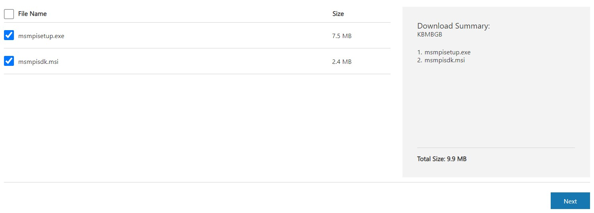
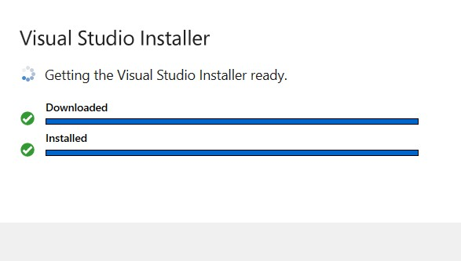
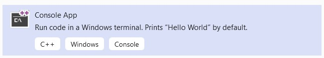
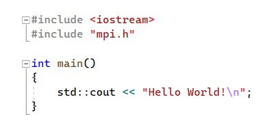

# Message Passing Interface (MPI):

# Steps:

1.  Download Visual Studio from the following link :

    - [Visual Studio Community 2022](https://visualstudio.microsoft.com/thank-you-downloading-visual-studio/?sku=Community&channel=Release&version=VS2022&source=VSLandingPage&cid=2021&passive=false)

2.  Download useful files for MPI from the following link:

    - [Microsoft MPI v10.0](https://www.microsoft.com/en-us/download/details.aspx?id=57467)

    * Select both files and click on `next` button
    
      

3.  After downloading install `msmpisetup.exe` application:
    - Leave all as default and click on next and once the installation is done click on finish
4.  Run `msmpisdk.msi` installer leaving all as default

5.  Now run the `Visual Studio installer` file which was downloaded above.

    - Click `Continue` to accept the `terms and conditions`.
    - Once the downloading and installation is done, you are required to sign in using your `Microsoft Acoount`.
      

    - After successful signing in, you will be directed to choose the required workloads. Here we need to select the required workloads.
    - Check the box of required workloads and Click on `Install/Modity` by leaving the option as `Install while downloading`.
    - In my case `Desktop Development for C++` is enough.
    - It requires nearly 3GB of data to finish whole installation process.
    - Once the installation is done `reboot the application`.

6.  Now after getting restarted, Click on `Create a new project` and then

    1. Select `C++` in `All Programs` drop-down. 
    2. Now select `Console App` as shown below and click `next`
       - 

    3. Now choose your `Project Name` and click `Create`.
    4. Call MPI header file: `#include "mpi.h"` as shown below:
        - 
       
##  [Configuring mpi using Visual Studio - Hello World](https://youtu.be/L3cBUdLSb-M)

- [x] Download 
- [x] Install
- [x] Ready to use

## :man_astronaut: ***Work in progress *** 
